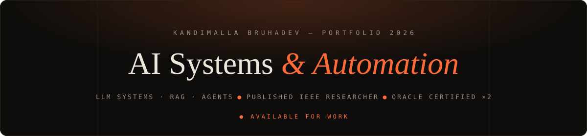
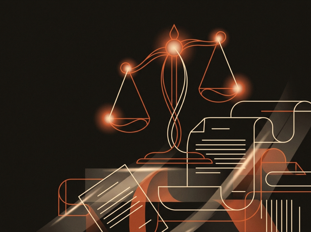
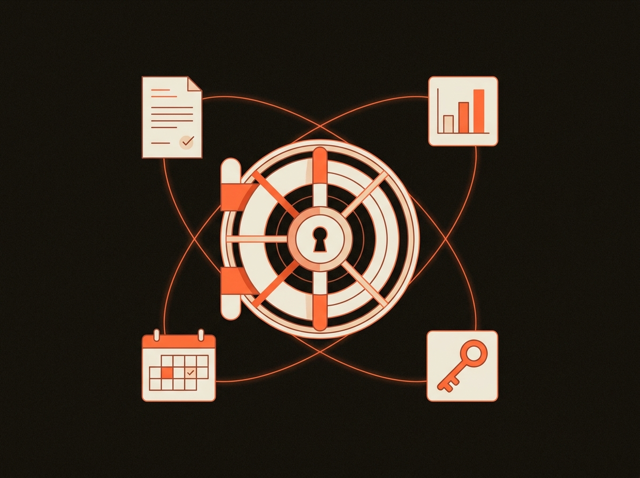
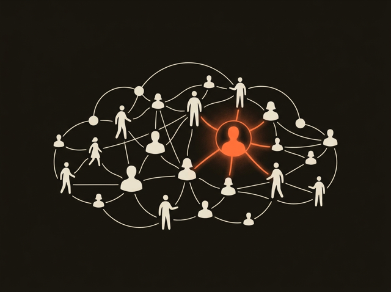
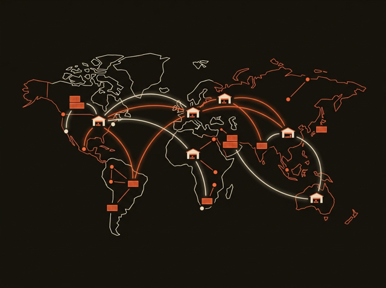
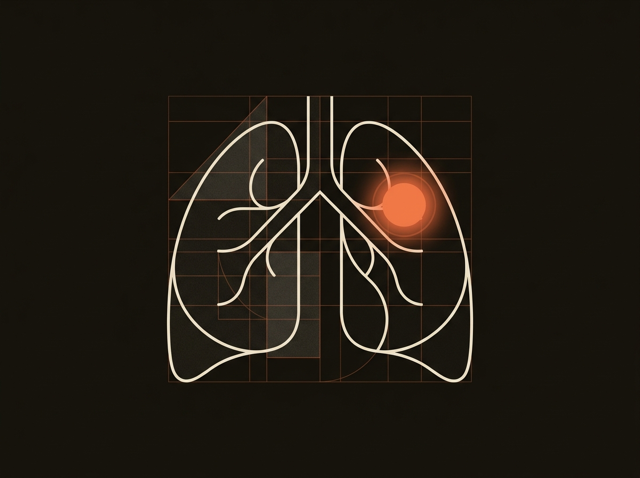

I build grounded AI systems — retrieval pipelines, LLM agents, and the production software around them. **First author of an IEEE paper on JurisGPT**, a citation-grounded legal assistant over **47,867 Indian legal documents** — hybrid retrieval at **Recall@5 0.84 / MRR 0.95**, with **80% citation-faithful answers**. Currently building AI automation at **InvisiEdge Marketing**. Oracle certified ×2.

 

## Featured Work

<table>
<tr>
<td width="50%">

### [JurisGPT](https://jurisgpt.me) · IEEE Paper
Citation-grounded legal RAG for Indian startup & corporate law. 47.8K-document corpus, hybrid BM25 + lexical retrieval with weighted RRF, calibrated confidence badges.
`RAG` `FastAPI` `Next.js` · [code](https://github.com/Bruhadev45/Juris-GPT)

</td>
<td width="50%">

### [Vectius](https://vectius.io) · Client Work
SaaS operations platform: AES-256-GCM credential vault, invoice OCR + LLM autofill with approval chains, spend analytics, GPT-4o-mini assistant.
`SaaS` `Security` `LLM Extraction`

</td>
</tr>
<tr>
<td width="50%">

### [AI-Powered HRMS](https://ai-powered-hrms-bruuu.vercel.app)
AI resume parsing, candidate–job matching, interview assistant, and a RAG-based HR chatbot. Next.js 15 + Turso.
`Next.js 15` `RAG` `Turso` · [code](https://github.com/Bruhadev45/ai-powered-hrms)

</td>
<td width="50%">

### [FinSight-X-AI](https://fin-sight-x-ai.vercel.app)
AI financial-insights assistant — extracts metrics, sentiment, and risk from filings and news with RAG grounding.
`GPT-4` `RAG` `Python` · [code](https://github.com/Bruhadev45/FinSight-X-AI)

</td>
</tr>
<tr>
<td width="50%">

### [Multi-Agent Supply-Chain Optimizer](https://github.com/Bruhadev45/AI-Multi-Agent-Supply-Chain-Optimizer)
Specialized agents collaborating in real time on routing, inventory, and demand forecasting.
`Multi-Agent` `CrewAI` · [demo](https://huggingface.co/spaces/Bruha01/AI-supply-chain-optimizer)

</td>
<td width="50%">

### [Lung Cancer Classification](https://github.com/Bruhadev45/Lung-Cancer-Classification-Using-Multimodal-Image-Analysis)
Multimodal medical-image classification with CNNs and transfer learning — 95%+ F1-score.
`Computer Vision` `Deep Learning`

</td>
</tr>
</table>

 

## Research

> **JurisGPT: A Citation-Grounded Legal Assistant for Indian Startup and Corporate Law** — IEEE
>
> 120-query human-verified benchmark (Fleiss' κ = 0.81) across five retrieval configurations with paired bootstrap, Wilcoxon, and McNemar significance testing. Includes a negative result with practical value: a generic MS MARCO cross-encoder reranker **lowers** nDCG@5 by 8.7–16.3 points on legal text — legal RAG quality is corpus-bound, not retriever-bound.

 

## Stack

 

## Stats

 

**Open to AI engineering roles and consulting — LLM systems, RAG, and agents**

